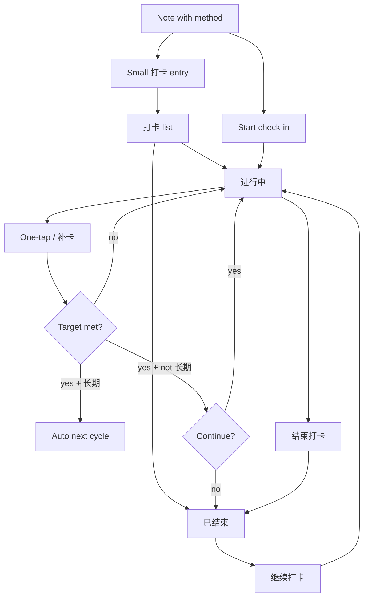
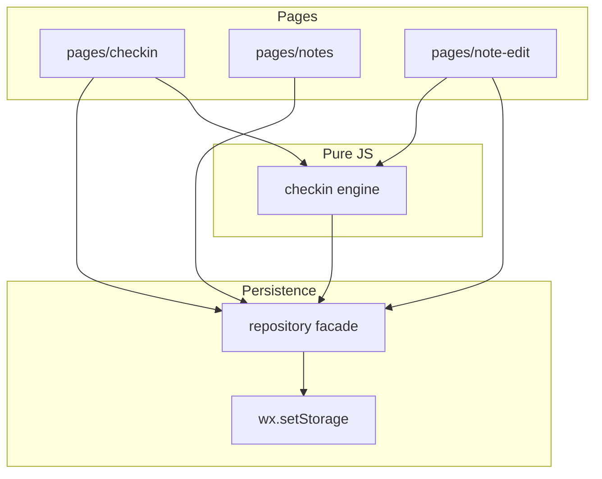
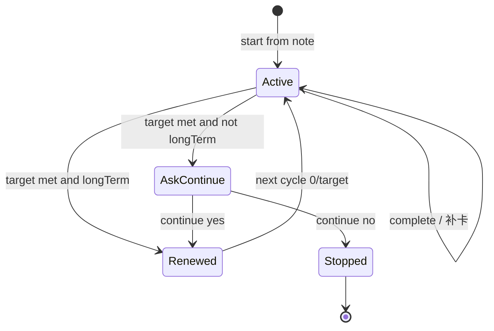

# Life Ben Mini Program - Plan

## Goal Capsule

- **Objective:** Ship a WeChat mini program that turns personal life notes into trackable habits, so the owner no longer relies on memory for practices like 五红汤 or 面膜.
- **Product authority:** This Product Contract. Primary actor is the owner (self-use only in V1).
- **Open blockers:** None for planning.

## Product Contract

### Summary

Build **生活本**, a native WeChat mini program with **local-only persistence**: notes (e.g. 五红汤做法、面膜方法) live under category tabs; each note can show a small **打卡** entry that opens the check-in list. The **打卡** tab (default) lists **进行中** and **已结束**; ended items can **继续打卡**. Long-term habits auto-renew until the owner stops them; short cycles ask whether to continue on success. Clock push and read-only share wait for later.

### Problem Frame

The owner already knows what to stick with (e.g. 五红汤, 敷面膜) but tracks everything in their head. Missed days and unfinished cycles are discovered after the fact. Separate apps for recipes, beauty tips, and habits scatter the same life practices. The need is one place where a practice note can become a countable habit with a clear period and progress, without building a full life OS on day one.

### Key Decisions

- **Check-in-first V1:** Habit rules are complete; notes are title + body + category enough to source a check-in.
- **Notes own check-ins:** Practices like 五红汤 / 面膜 are notes first; check-in is optional and always linked to a note; list labels use `分类·名称`.
- **Note → 打卡 entry:** Note **detail** is method-first. A small check-in icon after the title opens the **打卡** list; no large check-in panel competing with the recipe/method body.
- **打卡 list = 进行中 + 已结束:** Active and ended check-ins both live on the 打卡 tab; ended items offer **继续打卡** (same note, new/resumed cycle).
- **Navigation:** Top horizontal category tabs for notes; bottom **打卡** + **记录**; default open **打卡**.
- **Two goal kinds + long-term flag:** Continuous `已打/目标` or weekly `已打/一周 N 次`; **长期坚持** auto-opens the next cycle on success; owner can **结束打卡** anytime → moves to 已结束; without long-term, success prompts continue / stop (stop → 已结束).
- **Make-up allowed:** Missing a day is not an automatic fail; the owner can 补卡. V1 continuous progress is count toward the period target, not a hard streak-break fail.
- **Reminders deferred:** No clock push in V1; “今日待打” is visible when the mini program is open.
- **Local storage first:** V1 persists on-device only; no cloud sync. Clearing cache or changing phones can lose data.
- **Share deferred:** V1 has no share entry (read-only share returns when persistence supports it).

### Actors

- A1. Owner — creates notes, starts check-ins, taps complete / make-up, answers continue prompts.

### Key Flows

- F1. Browse and write a note
  - **Trigger:** Owner opens a category tab or creates a note.
  - **Actors:** A1
  - **Steps:** Pick 美食 / 美容 / 健身 / 存款 / 学习 → see note list → open or create note (title + body) → save.
  - **Outcome:** Note exists under a category and can source a check-in.
  - **Covered by:** R1, R2, R3

- F2. Start check-in from a note
  - **Trigger:** Owner enables check-in on a note.
  - **Actors:** A1
  - **Steps:** Choose continuous or weekly goal → set target (e.g. 14 days or 2×/week) → optionally mark 长期坚持 → check-in appears on 打卡 tab as `分类·名称`.
  - **Outcome:** Active check-in with progress `已打/目标` (or weekly form).
  - **Covered by:** R5, R6, R7, R8

- F3. One-tap complete or make-up
  - **Trigger:** Owner taps an active check-in on 打卡 (or from the note).
  - **Actors:** A1
  - **Steps:** One tap records today (or a make-up day) → UI shows check-in date, count, and checked state → progress updates.
  - **Outcome:** Progress reflects the new completion without requiring a long form.
  - **Covered by:** R9, R10, R11

- F4. Period success — long-term vs short
  - **Trigger:** Continuous target reached or weekly quota met.
  - **Actors:** A1
  - **Steps:** If 长期坚持 → auto start next identical cycle, no prompt. If not → ask whether to continue; Yes → same rules, next cycle immediately; No → move to **已结束**; note remains under its category.
  - **Outcome:** Owner either rolls into the next period or finds the item under 已结束 later.
  - **Covered by:** R12, R13, R15

- F5. Note 打卡 entry → list
  - **Trigger:** Owner opens a practice note detail (e.g. 五红汤制作页) and taps the small **打卡** icon after the title.
  - **Actors:** A1
  - **Steps:** Detail page keeps method content as the primary surface. Icon opens **打卡** tab list (进行中 / 已结束). Starting a new check-in is available from the list empty state or a secondary control on detail if none exists yet.
  - **Outcome:** Making/method reading is not competed with by a large check-in panel; check-in stays one tap away from the title.
  - **Covered by:** R16, R5

- F6. Resume ended / stop long-term
  - **Trigger:** Owner ends an active check-in, or taps **继续打卡** on an 已结束 item.
  - **Actors:** A1
  - **Steps:** End → item moves to 已结束 (note unchanged). Resume → new active cycle linked to the same note (reuse prior goal settings by default; owner may edit before confirming).
  - **Outcome:** Stopping does not lose the note or the ended record; restarting does not require recreating the note.
  - **Covered by:** R15, R17



### Requirements

**Notes and navigation**

- R1. The mini program provides top horizontal tabs for note categories: 美食, 美容, 健身, 存款, 学习.
- R2. Each category shows a list of that category’s notes; owner can create, open, edit, and delete notes.
- R3. A V1 note has at least title, body, and category; richer structured fields are not required.
- R4. Bottom tab bar includes an independent **打卡** tab; the mini program opens on **打卡** by default.

**Check-in model**

- R5. A check-in can only be started from an existing note.
- R6. Active check-ins display as `分类·名称` (e.g. 美食·五红汤, 美容·面膜).
- R7. Owner chooses goal type when starting: continuous (`已打次数 / 目标次数`) or weekly frequency (`已打次数 / 一周 N 次`), and sets the period numbers.
- R8. Owner may mark **长期坚持** when starting a check-in.

**Daily action**

- R9. Completing a check-in is one tap and shows check-in date, completion count, and a checked indicator.
- R10. Make-up (补卡) is allowed; missing a day does not auto-fail the period in V1.
- R11. Opening **打卡** shows two sections: **进行中** and **已结束**. 进行中 items show which still need action for the current period (“今日待打” at minimum when the app is open).

**Period completion**

- R12. On success with **长期坚持**: automatically enter the next cycle with the same rules, without prompting.
- R13. On success without **长期坚持**: prompt whether to continue; Yes starts the next cycle with the same rules immediately; No moves the check-in to **已结束** and keeps the note.
- R15. Owner can **结束打卡** on an active item (including long-term); it moves to **已结束**; the source note remains under its category.
- R16. Practice note **detail** centers on the method body. A small **打卡** icon sits after the title (not a large primary CTA); tapping it opens the **打卡** list. Optional compact status text may sit under the title. List rows may omit a competing CTA so browsing stays content-first.
- R17. An **已结束** item offers **继续打卡**, which creates a new active cycle on the same note (defaulting to prior goal settings).

### Acceptance Examples

- AE1. Continuous success + continue
  - **Covers:** R7, R9, R13
  - **Given:** Note「五红汤」with continuous 14-day check-in, not 长期.
  - **When:** Owner reaches 14/14 and chooses continue.
  - **Then:** A new 14-day cycle starts immediately at 0/14; note still linked.

- AE2. Weekly long-term auto-renew
  - **Covers:** R7, R8, R12
  - **Given:** Note「面膜」with weekly 2× and 长期坚持.
  - **When:** Owner hits 2/2 for the week.
  - **Then:** No continue prompt; next natural week starts at 0/2 automatically.

- AE3. Decline continue → 已结束
  - **Covers:** R13, R15
  - **Given:** Short-cycle check-in just succeeded.
  - **When:** Owner chooses not to continue.
  - **Then:** Item appears under **已结束**; source note remains under its category; **继续打卡** is available.

- AE4. Make-up does not wipe progress
  - **Covers:** R10
  - **Given:** Continuous 14-day check-in at 7/14 with one calendar day missed.
  - **When:** Owner 补卡 for the missed day.
  - **Then:** Count increases; period is not auto-failed solely because of the gap.

- AE5. Note entry opens 打卡 list
  - **Covers:** R16
  - **Given:** Note「五红汤」under 美食 with or without an active check-in.
  - **When:** Owner taps the small **打卡** entry on the note.
  - **Then:** App shows the **打卡** tab list (进行中 / 已结束).

- AE6. Resume ended check-in
  - **Covers:** R17
  - **Given:** 「美容·面膜」is under **已结束**.
  - **When:** Owner taps **继续打卡** and confirms.
  - **Then:** A new **进行中** cycle appears for the same note; ended history remains visible in 已结束 (or as prior cycle record).

### Success Criteria

- After about two weeks of personal use, the owner can see progress for practices like 五红汤 / 面膜 without relying on memory alone.
- Period state (in progress / succeeded / stopped) is understandable from the 打卡 list without a separate explanation screen.
- Creating a simple note and turning it into a check-in takes less friction than maintaining a parallel habit in the owner’s head.

### Scope Boundaries

**Deferred for later**

- Clock / subscription push reminders at set times (e.g. 07:00 五红汤, 21:40 面膜).
- Read-only note share (needs non-local persistence or an equivalent host).
- Cloud sync / multi-device backup.
- Deep note types (structured recipes, skincare steps, quote collections beyond plain body text).
- Savings as a real ledger (amounts, charts); V1 存款 is a normal note category.
- Family / multi-user shared check-ins.
- Analytics dashboards beyond per-check-in progress.

**Outside this product's identity**

- Social feed, community, or public content discovery.
- Desktop-style persistent left sidebar as the primary phone navigation.
- Replacing calendar, banking, or fitness-tracker platforms wholesale.

### Dependencies / Assumptions

- Platform is a WeChat mini program (phone-first), native toolchain (not uni-app for V1).
- Primary user is the owner; V1 has no share recipient path.
- “Continuous N days” in V1 means count toward N completions in the period with 补卡 allowed, not a hard fail-on-gap streak engine.
- Weekly periods use Monday–Sunday in the device local timezone.
- Local storage (~10MB total / ~1MB per key) is enough for personal notes + check-in history at V1 scale.

### Outstanding Questions

**Resolve Before Planning**

- None.

**Deferred to Planning** (resolved below in Planning Contract where applicable)

- Bottom tab set beyond **打卡** → resolved: **打卡** + **记录**.
- Make-up date picking → resolved: date picker for eligible past days in the current period.
- Read-only share constraints → deferred with share itself.
- Data sync / backup → deferred with local-first; optional export can be follow-up.

---

## Planning Contract

### Assumptions

- Owner develops and runs in WeChat DevTools + a personal WeChat account; AppID can be a test app initially.
- No existing application code in-repo (greenfield).
- Domain check-in logic is extracted as pure JS modules so Node unit tests can run without the WeChat runtime.

### Product Contract preservation

Product Contract updated during planning: local-only persistence; R14 / F5 / AE5 / A2 removed from V1 and moved to Deferred (user confirmed). Stable IDs R1–R13, F1–F4, AE1–AE4 preserved.

### Key Technical Decisions

- **KTD1. Native WeChat mini program, not uni-app.** V1 is phone-only WeChat; native keeps the surface area small. Revisit cross-end only if an App/H5 target appears.
- **KTD2. Local persistence via `wx.setStorage` behind a repository facade.** Single write path for notes and check-ins; UI never calls storage APIs directly. Enables a later cloud repository without rewriting pages.
- **KTD3. Pure check-in domain module.** Period math, progress, today-pending, success, renew, and continue decisions live in `domain/checkin/` with no `wx.*` imports. Pages call the domain then persist results.
- **KTD4. Bottom tabs: 打卡 (index 0, default) + 记录.** Category switching is a top scroller inside **记录**, not extra tabBar items (tabBar max 5; categories must stay flexible).
- **KTD5. Make-up uses a date picker.** Eligible dates: days in the current period that do not already have a completion; today remains one-tap on the list row.
- **KTD6. Weekly boundary Monday–Sunday local time.** Long-term weekly success rolls progress to `0/N` for the next week without a prompt.

### High-Level Technical Design





### Output Structure

```text
miniprogram/
  app.js
  app.json
  app.wxss
  pages/
    checkin/          # tab: 打卡 (default)
    notes/            # tab: 记录 + top category tabs
    note-edit/        # create/edit note + start check-in
  domain/
    checkin/          # pure engine + types
    notes/            # note helpers if needed
  services/
    repository.js     # load/save aggregate
  utils/
    date.js           # local week / day keys
tests/
  domain/
    checkin.test.js
package.json          # jest (or vitest) for domain tests only
project.config.json
README.md
```

### Alternative Approaches Considered

- **微信云开发:** Better for share and multi-device; deferred because V1 chose local-first speed.
- **uni-app:** Useful if App/H5 is near-term; deferred to avoid framework cost for a WeChat-only V1.
- **Check-in list without note binding:** Faster prototype; rejected — Product Contract requires check-ins from notes.

### Risk Analysis & Mitigation

- **Data loss (clear cache / new phone):** Mitigate with a plain-language empty-state / settings note that data is local-only; optional JSON export is follow-up, not V1.
- **Storage size:** Keep bodies as text; avoid embedding large images in V1 notes.
- **Domain bugs in renew/continue:** Cover AE1–AE4 in unit tests before wiring UI.

### Open Questions

**Deferred to Implementation**

- Exact storage key layout and migration helper if schema version bumps.
- Visual polish (icons, empty illustrations) within WeChat design defaults.
- Whether deleting a note auto-stops its active check-in (recommend yes; confirm in UI copy during impl).

---

## Implementation Units

### U1. Native mini program scaffold and navigation shell

- **Goal:** Runnable WeChat mini program with tabBar **打卡** (default) + **记录**, and a note-edit page route.
- **Requirements:** R1, R4
- **Dependencies:** None
- **Files:**
  - create: `project.config.json`
  - create: `miniprogram/app.js`
  - create: `miniprogram/app.json`
  - create: `miniprogram/app.wxss`
  - create: `miniprogram/pages/checkin/*`
  - create: `miniprogram/pages/notes/*`
  - create: `miniprogram/pages/note-edit/*`
  - create: `README.md`
- **Approach:** Configure `tabBar.list` with checkin first so cold start lands on 打卡. **记录** hosts a horizontal category control (美食…学习). Placeholder empty states only.
- **Patterns to follow:** WeChat official `app.json` tabBar + pages layout.
- **Test scenarios:**
  - Test expectation: none — scaffolding / config only; verify in DevTools that default tab is 打卡 and category chips render.
- **Verification:** DevTools preview opens on 打卡; switching to 记录 shows five category labels.

### U2. Local repository facade for notes and check-ins

- **Goal:** Single persistence API for the note list and check-in aggregate using local storage.
- **Requirements:** R2, R3, R5 (persistence seam)
- **Dependencies:** U1
- **Files:**
  - create: `miniprogram/services/repository.js`
  - create: `miniprogram/utils/date.js`
  - test: `tests/services/repository.test.js` (optional thin tests with storage mock)
- **Approach:** Versioned document `{ version, notes[], checkins[] }`. Repository methods: list/get/save/delete note; list active check-ins; upsert check-in; record completion dates. No UI imports.
- **Patterns to follow:** Facade over `wx.setStorageSync` / `wx.getStorageSync` with try/catch and empty defaults.
- **Test scenarios:**
  - Happy path: save note → reload → note present with category.
  - Happy path: upsert check-in linked to noteId → list active returns it.
  - Edge: missing storage key returns empty collections, not throw.
  - Error: oversized write surfaces a controlled failure path (mock storage throw).
- **Verification:** Repository round-trips a note and a check-in in DevTools console or unit mock.

### U3. Notes list and editor (category browse + CRUD)

- **Goal:** Owner can create, edit, delete notes under each category; list/detail show a small **打卡** entry that opens the 打卡 tab.
- **Requirements:** R1, R2, R3, R16
- **Dependencies:** U2
- **Files:**
  - modify: `miniprogram/pages/notes/*`
  - modify: `miniprogram/pages/note-edit/*`
  - create: `miniprogram/domain/notes/categories.js` (category constants)
- **Approach:** Top category tabs filter the list. Editor fields: title, body, category. List row and detail expose a compact **打卡** control → `wx.switchTab` to check-in page. No share button.
- **Patterns to follow:** Standard WeChat form + `wx.showModal` for delete confirm.
- **Test scenarios:**
  - Happy path: create「五红汤」under 美食 → appears only under 美食.
  - Covers AE5: tap 打卡 entry on note → lands on 打卡 tab.
  - Edge: empty title blocked with validation message.
  - Edge: delete note removes it from list.
- **Verification:** Manual path create → edit → delete; 打卡 entry switches tab.

### U4. Check-in domain engine (test-first)

- **Goal:** Pure functions implementing progress, today-pending, complete, make-up eligibility, success, long-term renew, stop → ended, and resume-from-ended.
- **Requirements:** R6, R7, R8, R9, R10, R11, R12, R13, R15, R17
- **Dependencies:** None (can parallel U2/U3 after types agreed)
- **Files:**
  - create: `miniprogram/domain/checkin/types.js`
  - create: `miniprogram/domain/checkin/engine.js`
  - modify: `miniprogram/utils/date.js` (week helpers from U2 as needed)
  - test: `tests/domain/checkin.test.js`
  - create: `package.json` (jest/vitest + scripts)
- **Approach:** Model status `active` | `ended`. Functions return next state + UI signals (`askContinue`, `autoRenewed`, `alreadyDoneToday`). `stopCheckin` / `resumeCheckin` move between sections.
- **Execution note:** Implement domain test-first; cover AE1–AE6 before page wiring.
- **Technical design (directional):**
  - `recordCompletion(state, dayKey)` → reject duplicate day; append; if met && longTerm → reset cycle; if met && !longTerm → flag `askContinue`.
  - `stopCheckin(state)` → `ended`; `resumeCheckin(state, settings?)` → new active cycle same noteId.
  - `partitionByStatus(list)` for 进行中 / 已结束.
- **Patterns to follow:** Pure functions in, plain objects out; no `wx` imports in `domain/`.
- **Test scenarios:**
  - Covers AE1–AE4 as before; AE3 leaves status `ended`.
  - Covers AE6: resume ended → active with prior defaults; ended record retained.
  - Happy path: `stopCheckin` on longTerm active → ended without deleting noteId.
  - Happy path: second tap same day → no double count.
  - Edge: cannot have two `active` check-ins for same noteId.
- **Verification:** `npm test` green for domain suite.

### U5. Start check-in from note and 打卡 list UI (进行中 / 已结束)

- **Goal:** Start check-in from a note; 打卡 tab shows **进行中** and **已结束** with resume on ended.
- **Requirements:** R5, R6, R7, R8, R11, R15, R16, R17
- **Dependencies:** U2, U3, U4
- **Files:**
  - modify: `miniprogram/pages/note-edit/*`
  - modify: `miniprogram/pages/checkin/*`
- **Approach:** Two list sections. Active rows: progress + 今日待打. Ended rows: summary + **继续打卡**. Active rows include **结束打卡**. Start form unchanged.
- **Patterns to follow:** Bind list on `onShow`.
- **Test scenarios:**
  - Happy path: start continuous 14 from「五红汤」→ under 进行中 as `美食·五红汤`.
  - Covers AE6: 继续打卡 on ended 面膜 → appears under 进行中.
  - Edge: block second active check-in for same note.
  - Integration: reopen app; both sections persist.
- **Verification:** Manual start, stop, resume across restart.

### U6. One-tap complete, make-up, and period success UX

- **Goal:** Daily complete / 补卡 and period-end behavior; decline continue lands in 已结束.
- **Requirements:** R9, R10, R12, R13, R15
- **Dependencies:** U5
- **Files:**
  - modify: `miniprogram/pages/checkin/*`
- **Approach:** One-tap today; 补卡 date picker; `askContinue` modal; Yes renews; No → ended. Long-term success silent renew; **结束打卡** always available on active.
- **Patterns to follow:** Mutations in engine; page displays signals.
- **Test scenarios:**
  - Covers AE1–AE4 via UI smoke after domain green.
  - Happy path: pending one-tap → checked + count bump.
  - Happy path: longTerm weekly hit → no modal.
  - Error: already-done today → gentle state, no crash.
- **Verification:** Walk AE1–AE6 manually; domain tests remain green.

---

## Verification Contract

| Gate | Command / action | Applies to |
|---|---|---|
| Domain unit tests | `npm test` from repo root (script runs `tests/domain/**`) | U4, regression for U5–U6 |
| DevTools smoke | WeChat DevTools: cold start → 打卡 default; create note; start check-in; complete; makeup; continue/stop | U1, U3, U5, U6 |
| Persistence smoke | Restart simulation / clear and restore not required; reopen app after writes | U2, U5 |

No CI required for V1 personal ship; add later if desired.

## Definition of Done

- R1–R13 and R15–R17 satisfied in the running mini program on local storage.
- Domain tests cover AE1–AE6; `npm test` passes.
- No share entry in UI.
- README explains: how to open in DevTools, local-only data caveat, note→打卡 entry, 进行中/已结束, and check-in rules in one short section.
- Product Contract IDs above remain the acceptance authority for behavior disputes.

## Sources & Research

- WeChat tabBar max 5 items — keep categories out of tabBar ([community / docs consensus](https://ask.csdn.net/questions/9166906)).
- `wx.setStorageSync` ~1MB/key, ~10MB total ([official API](https://developers.weixin.qq.com/miniprogram/dev/api/storage/wx.setStorageSync.html)).
- Origin Product Contract: `docs/plans/2026-07-24-001-feat-life-ben-miniprogram-plan.md` (enriched in place).
